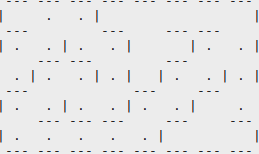

## Compilation

gcc -ansi -Wall maze.c LIFO_empty_ascending.c -o maze

## Maze structure

The maze is an array of boxes. 

## Functions explanations

# box* GennEmptyLaby(void)

Generate an empty maze : allocate memory and initialize every boxes :

 # maze GenerateMaze(box *m_data, coord start, coord exit)

The random generation of the maze is based on the mermorisation of the path on the stack and putting every connected boxes to a "connected state"

The random generation of a maze is based on the use of a stack allowing to store the already handled boxes. The idea is the following one: we start from the entrance box (start) which becomes the current box. If on the current box, there are several possible directions for a connection (without going back), we choose one at random. 
If there is only a single possible direction (always without going back), we shall go in this direction. When a direction is chosen, we connect the current box with the one that was randmly picked. We memorize the current box in the stack with its coordinates. We move then in this direction, and the connected box became the current one.
If no direction is possible (except going back) we are in a dead end. In this case, we unstack the boxes until we find a box where all the directions are not handled. The function stops when all the boxs are handled.

The figure below give an example of generation. The order is indicative and depends of
Random choice of the directions.

In the terminal, the first connection look like :

And the after initialazing every boxes state to 0 and opening the start and exit boxes :

# int SolveMazeRec(maze m, box* current, box* previous)

This function solve recursively the maze.

this function try every possible way in the maze

The output condition is :
	- The exit has been found 
	- The current box is a dead end

for the first condition, every fucntions is pull from the heap and the function stop here.

In the second condition, the current box go back from the dead end to the first branch found and try an other way.

Solved maze :

 ## Sources 

The GenerateMaze explanation and the image is extracted from a test written by Frédéric Rousseau at Polytech Grenoble

## Author

FroxThur the 26/03/2017
